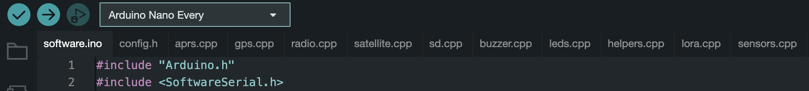

# Balloon Tracker Software

Download the needed libraries, edit `config.h`, and upload to your Arduino.

*Note: The hardware and software surrounding this project has been built to run on an Arduino Nano Every. These are the same form factor as Arduino Nanos just with more RAM. If you choose to use a different board, ensure it can fit everything in RAM with room to spare when uploading (dynamic memory should not exceed 80%), and be sure to modify the pin-outs in the config as necessary.*

## Initial Setup

To upload this code to an Arduino, it is suggested you use the Arduino IDE. 

Once the Arduino IDE is installed, download this GitHub project as a zip. 

Unzip it and navigate to Balloon-Tracker/Software. 

Open `software.ino` in the Arduino IDE. This should open many other files in tabs beside it like so:



*Note: Your IDE may not say Arduino Nano Every until you have installed the Board Manager in the next step.*

## Required Installs

### Boards Manager Installation

In the Arduino Boards Manager, search for:
"Arduino MegaAVR Boards" by Arduino and install it. This is for programming your Arduino Nano Every.

Now, under Tools, select Board > Arduino MegaAVR Boards > Arduino Nano Every.

When you have plugged your Arduino in, go to Tools > Port, and select the port it is plugged into.

**NOTICE: you need to have the satellite/HAM radio daughterboard unplugged from the Molex pin on the motherboard before plugging in the Arduino.**

### Library Installation

The codebase of this project relies on several 3rd party libraries that do not come pre-packaged with Arduino. You will need to install these through Arduino IDEs Library manager. Search for and install:

- "TinyGPSMinus" by Eric Andrechek
- "LoRa" by Sandeep Minstry
- "SD" by Arduino, SparkFun

## Config

There are some mandatory settings you **MUST** change in the config.h file before you can upload and run this software. Open `config.h` in your Arduino IDE and read through it. It is self documented.

Please be sure you have thoroughly read through this file before hitting Upload on your code. If something is misconfigured, it could cause permanent damage to any one of your components.

## Uploading

After you have set up the Arduino IDE properly by installing the board manager and libraries, have modified your config appropriately, have disconnected the daughterboard, and have selected the correct board and port in the Arduino IDE, you are ready to upload.

Click the Upload button (Right Arrow), and the Arduino IDE should begin compiling and uploading your code. 

If you see an error reading `avrdude: jtagmkII_initialize(): Cannot locate "flash" and "boot" memories in description`, you can safely ignore it, it is a known issue with uploading to an Arduino Nano Every that has no impact on its performance. Any other errors need to be troubleshooted or your tracker likely will not work.

Make note of the data output after uploading. It should look somethings like this:

```
Sketch uses 27864 bytes (56%) of program storage space. Maximum is 49152 bytes.
Global variables use 1457 bytes (23%) of dynamic memory, leaving 4687 bytes for local variables. Maximum is 6144 bytes.
```

If you are using a board other than the Arduino Nano Every, pay special attention to these percentages, ensuring that ideally neither but especially the second does not go above 75-80%, or unexpected errors will occur during flight.

## Troubleshooting

If verifying/uploading fails, your first step should be Google. If this fails, feel free to open an issue, others may benefit from you asking as well. If Google does help solve it, feel free to open an issue and document what occurred and how you fixed it so that others can use you as a reference.

If the error LED on the motherboard is flashing or staying on during usage, or if it just doesn't seem to be working, follow the general debugging steps below:

1. Disconnect the transmitter daughterboard module from the motherboard.

2. Modify the debug configuration section in `config.h` so that `#define DEBUG` is uncommented. (For usage, make sure to comment it out again!)

3. Plug your Arduino (and motherboard) into your computer. Keep the battery connected as you normally would for flight. The only difference with this should be that the daughterboard is removed and the Arduino is plugged into your computer.

4. Upload the modified `config.h` to your Arduino. When uploading is complete, open the Serial monitor and read through it to see what is being printed out. Any error LED events will print the source of the error to the serial monitor.

5. If this still doesn't help you troubleshoot your issue, feel free to open an issue on the GitHub. If you are more technically savvy and want to try further troubleshooting, there is a helpful function defined in `helpers.h` called `print_free_mem()` that will output the number of bytes in RAM available to the serial monitor. This may help you hunt down a memory leak or other issue.